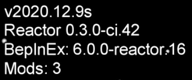

# Installing BepInEx and Reactor

# Table of Contents
- [Locating the Among Us game files directory](#locating-the-among-us-game-files-directory)
- [Installing BepInEx](#installing-bepinex)
- [Installing Reactor](#installing-reactor)

## Locating the Among Us game files directory

On steam, this can be achieved by right clicking Among Us in the steam
library then selecting `Manage > Browse local files`.

## Installing BepInEx

1. Download the latest release from the NuclearPowered/BepInEx
   [releases](https://github.com/NuclearPowered/BepInEx/releases) page.
2. Unzip the files into the Among Us game files directory. It should 
   look something like this after you add BepInEx:
   
```
.
├── Among Us_Data
├── Among Us.exe
├── BepInEx
│   ├── core/
│   └── unity-libs/
├── changelog.txt
├── doorstop_config.ini
├── GameAssembly.dll
├── mono
│   ├── Managed/
│   └── MonoBleedingEdge/
├── UnityCrashHandler32.exe
├── UnityPlayer.dll
└── winhttp.dll
```

3. Launch the game so that BepInEx can generate the necessary files, 
   then close the game after. The Among Us game files should now look 
   something like this:
   
```
.
├── Among Us_Data
├── Among Us.exe
├── BepInEx
│   ├── cache/
│   ├── config/
│   ├── core/
│   ├── patchers/
│   ├── plugins/
│   ├── unhollowed/
│   └── unity-libs/
├── changelog.txt
├── doorstop_config.ini
├── GameAssembly.dll
├── mono
│   ├── Managed/
│   └── MonoBleedingEdge/
├── UnityCrashHandler32.exe
├── UnityPlayer.dll
└── winhttp.dll
```
   
## Installing Reactor

1. Go to the
   [Reactor CI](https://github.com/NuclearPowered/Reactor/actions)
   page.
2. Click on the top workflow run.
3. Download the `Reactor.dll` artifact.
4. Move the `Reactor.dll` file to the
   `(Among Us game files)/BepInEx/plugins` folder.
5. Launch the game. The top left of the game menu should look
   something like this:
   
