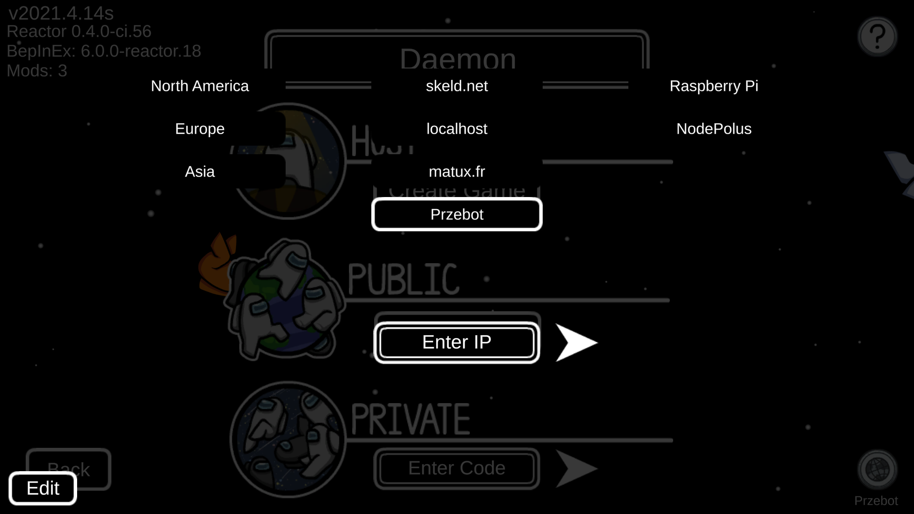
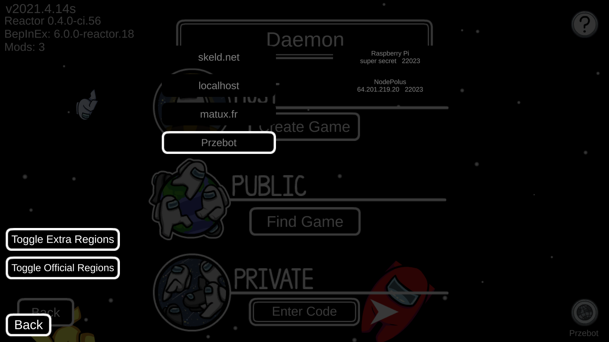

# Unify

An Among Us mod to add extra regions to the region menu.

# Table of Contents
- [Features](#features)
- [Installation](#installation)
- [Configuration](#configuration)

## Features

The following regions have been added:
- [skeld.net](https://skeld.net/)
- localhost *(for playing on a server running on your computer)*
- matux.fr
- Przebot (may be unreliable or outdated)

Regions can be connected to directly using an IP address.

Custom regions can be added as detailed below in the
[configuration](#configuration) section.

Other mods can add regions via the
`AddRegion(string name, string ip, ushort port)` API method.

## Installation

> **⚠ WARNING**
>
> This mod is compiled against the steam edition of the game, but should work on any edition on a version between 2021.5.10 and 2021.5.25.2, including the Itch and Epic Games editions.

> If you are still using 2020.12.9s and Reactor fails to load, try using the Reactor version located
> here: https://github.com/NuclearPowered/Reactor/actions/runs/593649307.

> If you are still using 2021.3.5s and Reactor fails to load, try using the Reactor version located
> here: https://github.com/NuclearPowered/Reactor/actions/runs/636023321.

> If you are still using 2021.4.12s-2021.4.14s and Reactor fails to load, try using the Reactor
> version located here: https://github.com/NuclearPowered/Reactor/actions/runs/827746360

1. Ensure that BepInEx and Reactor (Reactor is not required for pre releases) are installed
   ([installation guide](INSTALLATION.md)).
2. Download the latest mod on the [releases](https://github.com/DaemonBeast/Unify/releases) page
   for the version of Among Us you are using.
3. Move the mod to the `(Among Us game files)/BepInEx/plugins` folder.
4. Launch the game.

## Configuration

> **⚠ WARNING**
>
> The configuration file will be generated when loading the mod for
> the first time. If the configuration file is not there, try
> launching the game and closing it to see if the configuration
> file creates itself.

The configuration file is located at
`(Among Us game files)/BepInEx/config/daemon.unify.cfg`.

### Custom regions

Custom regions can be added by modifying the `[Region 1]`,
`[Region 2]` ... `[Region 9]` sections of the configuration file.
You can modify the display name of the region,
the IP address of the region and the port of the region.

If the IP field is left empty, the region will not show up in game.
